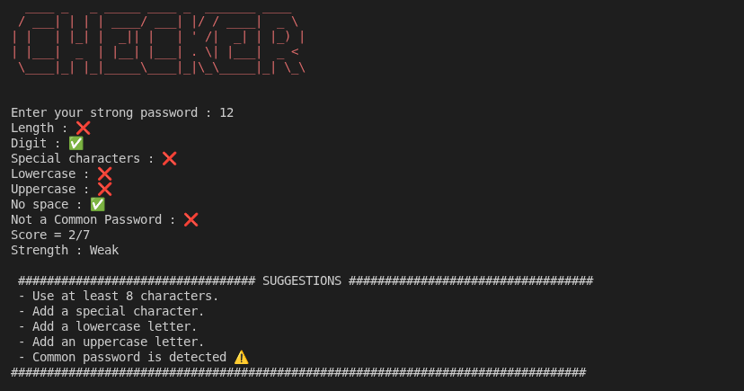

# 🔐 Password Strength Checker

A command-line password strength checker written in Python.

The program evaluates a password using multiple security rules, calculates a score, assigns a strength level, and provides suggestions for improving the password.

<p align="center">
  
</p>

## Features

* Minimum password length check
* Recommended length of 12+ characters
* Uppercase letter detection
* Lowercase letter detection
* Digit detection
* Special character detection
* Space detection
* Common password detection using a wordlist
* Rule-based password scoring
* Password strength classification
* Personalized improvement suggestions
* Colored terminal output
* ASCII-art terminal banner

## Strength Levels

The password is evaluated using **7 security checks**:

| Check             | Description                                 |
| ----------------- | ------------------------------------------- |
| Length            | At least 8 characters                       |
| Digit             | Contains a number                           |
| Special Character | Contains a special character                |
| Lowercase         | Contains a lowercase letter                 |
| Uppercase         | Contains an uppercase letter                |
| No Spaces         | Does not contain spaces                     |
| Common Password   | Does not match a password from the wordlist |

The final score is calculated out of **7**.

The password is then classified as:

* **Strong** — passes 6–7 checks and contains at least 12 characters
* **Medium** — passes 3–5 checks
* **Weak** — passes 2 checks
* **Very Weak** — passes 0–1 checks

## Example Output

```text
Length : ✅
Digit : ✅
Special characters : ✅
Lowercase : ✅
Uppercase : ✅
No space : ✅
Not a Common Password : ✅

Score = 7/7
Strength : Strong
```

If a password fails one or more checks, the program provides suggestions:

```text
############################ SUGGESTIONS ############################

 - Add a special character.
 - Add at least 8 characters.

######################################################################
```

## Project Structure

```text
password-strength-checker/
├── assets/
│   └── password-checker.png
├── checker.py
├── pass.txt
├── README.md
├── requirements.txt
├── .gitignore
└── LICENSE
```

### Files

* `checker.py` — Main application and password analysis logic
* `pass.txt` — Wordlist used to detect common passwords
* `requirements.txt` — Python dependencies
* `README.md` — Project documentation
* `LICENSE` — MIT License

## Technologies

* **Python 3**
* **pyfiglet** — ASCII-art banner
* **termcolor** — Colored terminal output
* **string** — Python standard library

## Requirements

* Python 3.x
* pip

## Installation

### 1. Clone the repository

```bash
git clone <repository-url>
cd password-strength-checker
```

### 2. Install dependencies
```bash
pip install -r requirements.txt
```

### 3. Run the program

```bash
python checker.py
```

## How It Works

The program performs several independent checks against the provided password.

Each successful check increases the password score:

```text
Password
   │
   ├── Length check
   ├── Digit check
   ├── Special character check
   ├── Lowercase check
   ├── Uppercase check
   ├── Space check
   └── Common password check
           │
           ▼
      Score / 7
           │
           ▼
    Strength Rating
           │
           ▼
     Suggestions
```

## What I Practiced

This project helped me practice:

* Python functions
* Boolean logic
* Conditional statements
* Loops
* Lists
* File handling
* Reading wordlists
* String manipulation
* Input validation
* Exception-free validation logic
* Python standard library
* Third-party packages
* Modular function design
* Building a command-line security tool

## Security Concepts

This project introduces several basic password-security concepts:

* Password length
* Character diversity
* Common-password detection
* Password policies
* Rule-based password scoring
* Password security recommendations

> **Note:** This is an educational, rule-based password checker. The score is not a definitive measurement of real-world password security. Modern password strength assessment can also consider password entropy, leaked credentials, patterns, context, and password-cracking resistance.

## Future Improvements

* Password entropy estimation
* Detection of repeated characters
* Detection of keyboard sequences such as `qwerty` and `123456`
* More advanced common-password detection
* Integration with larger password datasets
* Password generation
* Automated tests
* Export results to a report file
* Command-line arguments using `argparse`

## Project Status

**Completed — Learning Project**

This project was created as part of my Python and cybersecurity learning journey to practice Python programming while exploring basic password-security concepts.

The project can be improved in the future with more advanced password-analysis techniques and security-focused features.

## License

This project is licensed under the MIT License.

See the [LICENSE](LICENSE) file for more information.
