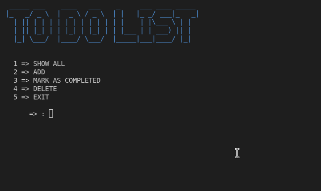

# Todo List

A command-line Todo List application built with Python and SQLite.

<p align="center">
  
</p>

This project was created as part of my Python learning journey to practice database operations, CRUD functionality, modular programming, exception handling, input validation, and application structure.

## Features

* Add new todo tasks
* Display all tasks
* Mark tasks as completed
* Delete tasks
* Prevent duplicate task names
* Store tasks in an SQLite database
* Interactive command-line interface

## Technologies

* Python
* SQLite

## Project Structure

```text
to-do-list/
├── main.py
├── utils/
│   └── utils.py
├── assets/
│   └── todo-list.png
├── README.md
├── LICENSE
├── .gitignore
└── requirements.txt
```

## Requirements

* Python 3.10 or newer
* pip

## Installation

### 1. Clone the repository

### 2. Create a virtual environment

```bash
python -m venv .venv
```

### 3. Activate the virtual environment

#### Windows

```powershell
.venv\Scripts\activate
```

#### Linux / macOS

```bash
source .venv/bin/activate
```

### 4. Install dependencies

```bash
pip install -r requirements.txt
```

## Usage

Run the application with:

```bash
python main.py
```

The application automatically creates the SQLite database and required tables if they do not already exist.

## Available Operations

```text
1 => SHOW ALL
2 => ADD
3 => MARK AS COMPLETED
4 => DELETE
5 => EXIT
```

## What I Practiced

This project helped me practice:

* Python functions
* Modules and imports
* Lists and dictionaries
* Loops and conditional logic
* Exception handling
* Input validation
* SQLite database connections
* SQL queries
* CRUD operations
* Database structure
* Modular code organization
* Debugging and problem solving

## Project Status

**Not completed**

This project represents an earlier stage of my Python learning journey. It may be improved in the future as my programming and software development skills develop.

> **Note:** The terminal clearing functionality currently works only on Windows.

## License

This project is licensed under the MIT License.

See the [LICENSE](LICENSE) file for more information.
